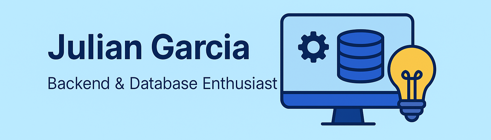

  

# 👋 Hi, I'm Julian Garcia

**Systems Engineering student** at Universidad Distrital (Bogotá, Colombia)  
**Junior Backend Developer** with a strong focus on **Java, Spring Boot, and relational databases**  

I build **clean, well-structured REST APIs**, design **relational data models from scratch**, and care about **code quality, architecture, and documentation**.  
Currently open to **junior roles, freelance projects, and open-source collaborations**.

---

# 👋 Hola, soy Julian Garcia

**Estudiante de Ingeniería de Sistemas** en la Universidad Distrital (Bogotá, Colombia)  
**Desarrollador Backend Junior**, enfocado en **Java, Spring Boot y bases de datos relacionales**

Desarrollo **APIs REST bien estructuradas**, diseño **modelos de datos relacionales desde cero** y le doy importancia a la **arquitectura, buenas prácticas y documentación**.  
Abierto a **primer empleo, proyectos freelance y colaboraciones open source**.

---

## Tech Stack

### Backend & Languages
- **Java (Core / OOP / Design Patterns)**
- **Python (Core, scripting, basic data libraries)**

### Frameworks & Tools
- **Spring Boot**
- **Spring Data JPA / Hibernate**
- **Swagger / OpenAPI**
- Git & GitHub

### Databases
- **PostgreSQL**
- Relational modeling (ER & relational schemas)
- Constraints, triggers, and basic query optimization

---

## Featured Projects

### 🔹 Hotel Management System
🔗 https://github.com/Edd022/basesdedatos  

Backend system built with **Spring Boot + PostgreSQL** for managing hotel operations.

**Key features & learnings:**
- Relational database design from scratch (ER → relational model)
- Complex relationships and constraints
- Clean REST API architecture
- Monolithic architecture with design patterns
- Focus on data integrity and consistency

---

### 🔹 Commercial Management System
🔗 https://github.com/Edd022/ComercialManagement  

REST API for a **commercial operations system**, including products, warehouses, users, and simulated sales.

**Key features & learnings:**
- CRUD and business logic for commercial workflows
- Well-structured REST endpoints
- Relational database design
- API documentation with Swagger
- Backend-oriented project focused on real-world scenarios

---

### 🔹 RL Agent 2048 (Monte Carlo Simulation)
🔗 https://github.com/Edd022/RL-Agent-2048  

Reinforcement Learning agent developed in **Python** to play the 2048 game using **Monte Carlo methods**.

**Key features & learnings:**
- Reinforcement Learning fundamentals
- Simulation-based decision making
- Collaborative development
- Applied Python for AI experimentation

---

## GitHub Stats

## Top Languages

---

## Let's Connect

- Email: [garciajulian258@gmail.com](mailto:garciajulian258@gmail.com)
- LinkedIn: https://www.linkedin.com/in/julian-garcía-a00276174/
- GitHub: https://github.com/Edd022
